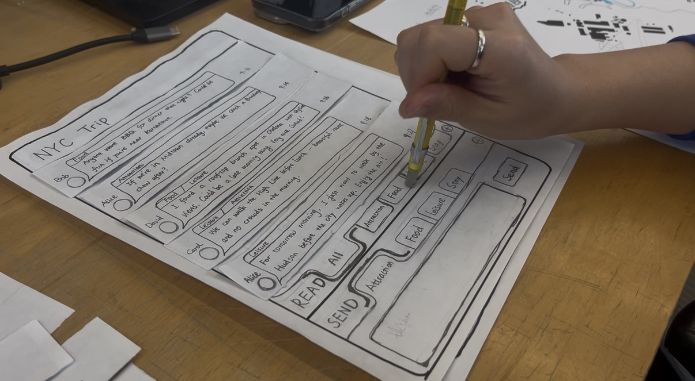
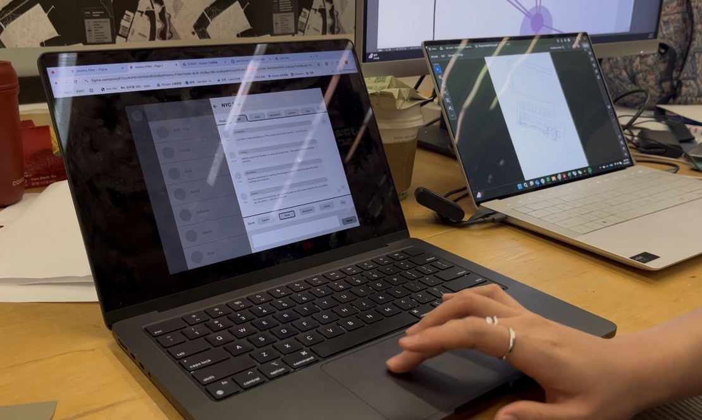
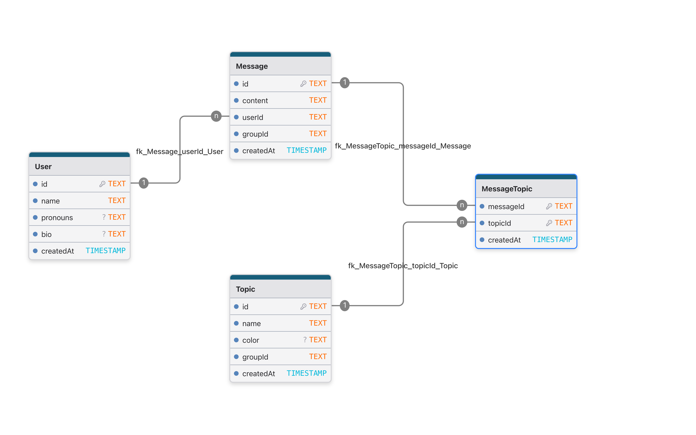
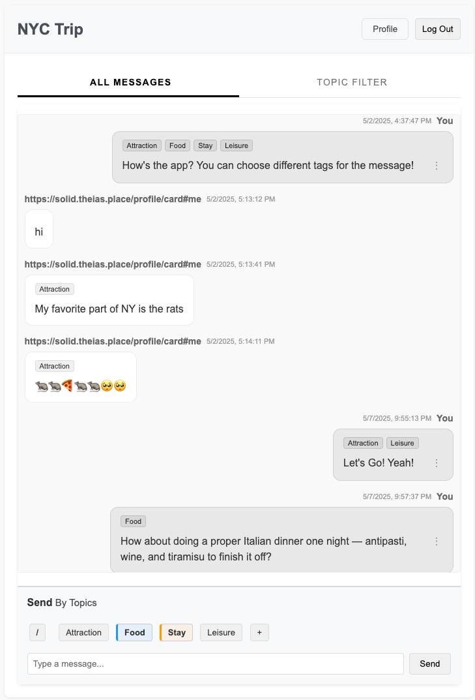
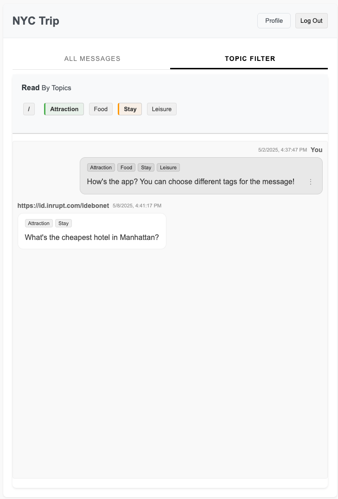

# Topic-based Group Chat

## Background & Problem
Current group chat platforms such as Discord, Slack, and WhatsApp often lead to overwhelming message volumes in active conversations. Through semi-structured interviews with 5 users, I found this issue to be especially pronounced in **semi-formal group chats** (e.g., friend trip planning, reading circles, hobby groups). These settings require both **casual, spontaneous conversation** and **structured topic navigation** over time—a need not well-served by current tools.

## Scope & Objective
To address this, I proposed, designed, and implemented a **Topic-based Group Chat** system. For convenience and representativeness, I focused on a **NYC travel planning group** as the primary scenario. In such chats, users discuss food, lodging, transportation, and sightseeing to New York City in a fluid, overlapping manner. At the same time, they also need the ability to view each theme individually—for example, isolating all transportation-related messages when booking tickets. This presents a unique design challenge: **to balance casual, spontaneous conversation with structured topic navigation**.

## Prototype

### Design
The design process involved comprehensive user research and iterative prototyping:
- **Semi-structured User Interviews**: Conducted interviews with 5 users to understand pain points in current group chat platforms
- **Iterative Design Improvements**: Multiple rounds of design refinement based on user feedback
- **Paper Prototyping Testing**: Rapid testing of interface concepts through low-fidelity prototypes
- **Figma Prototype Testing**: High-fidelity interactive prototypes to ensure the software design meets user needs and satisfaction

<table>
  <tr>
    <td align="center">
       
      <em>Paper Test</em>
    </td>
    <td align="center">
       
      <em>Figma Test</em>
    </td>
  </tr>
</table>

### Implementation
The technical implementation covers the full-stack development:
- **Database Design**: Modeled core entities and relationships using Prisma ORM with PostgreSQL:
    <figure style="display:inline-block; margin:5px;">
    
    </figure>

  *See full schema: [backend/prisma/schema.prisma](backend/prisma/schema.prisma)*

- **Frontend Development**: Built with Next.js, TypeScript, and Tailwind CSS to create a responsive and intuitive user interface with Google OAuth authentication. Designed animation to imrpove usability.

  <figure style="display:inline-block; margin:10px;">
    
  </figure>
  <figure style="display:inline-block; margin:10px;">
    
  </figure>

- **Backend Development**: Developed using Node.js, Express.js, and Prisma ORM to provide RESTful API services and type-safe CRUD operations for user, message and topic entity.

- **Deployment**: All components (frontend, backend, and database) are deployed on Render platform and connected through internal server communication
